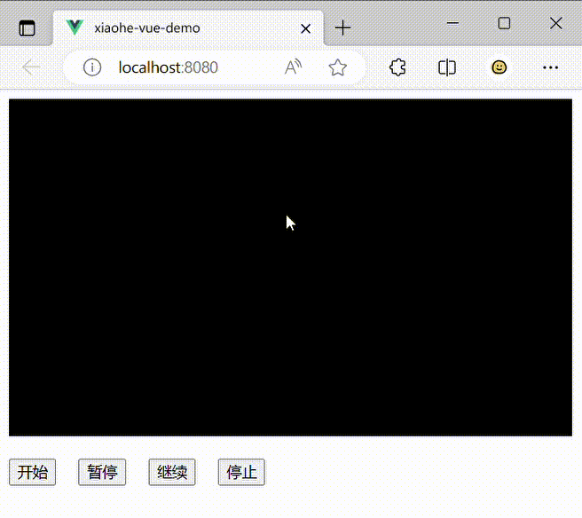

## XhTransitionRepeater 过渡动画重复器

### 🛹 使用

#### 简单使用

``` javascript
import XhTransition, { XhTransitionRepeater } from "xiaohe-transition";

const transition = new XhTransition({
  start: 0,
  target: 1000
}, (value) => {
  console.log("当前值发生变化", value);
});

// 调用start方法后，动画将会开始无限重复播放
const repeater = XhTransitionRepeater(transition).start();

// 调用stop方法即可停止动画
repeater.stop();
```

#### 进阶用法

``` javascript
import XhTransition, { XhTransitionRepeater, XhTransitionRepeatMode } from "xiaohe-transition";

const transition = new XhTransition({
  start: 0,
  target: 1000
}, (value) => {
  console.log("当前值发生变化", value);
});

// 完整配置请参考下方 `类型定义` 中的说明
const repeater = new XhTransitionRepeater(transition, {
  // 重复次数
  count: 10,
  // 重复模式
  mode: XhTransitionRepeatMode.alternate,
  started(instance, transition) {
    console.log("动画开始~");
  },
  paused(instance, transition) {
    console.log("动画暂停~");
  },
  resumed(instance, transition) {
    console.log("动画继续~");
  },
  stopped(instance, transition) {
    console.log("动画停止~");
  },
  // 注意！！！XhTransition的completed回调函数将会被XhTransitionRepeater占用，可使用repeated回调函数替代
  repeated(count, instance, transition) {
    console.log("动画重复~");
    console.log("已重复次数", count);
  },
  completed(instance, transition) {
    console.log("动画完成~");
  }
});

repeater.start();

// 现在应该使用XhTransitionRepeater中的相关方法来替代XhTransition控制动画
repeater.pause();
repeater.resume();
repeater.stop();
```

#### 应用场景

> 为方便起见，应用场景示例以 `Vue` 举例，但并不局限于 `Vue` 使用

> 注：以下效果展示GIF图片经过压缩抽帧处理，看似卡顿实际很流畅

##### 跑马灯

[查看示例代码](../demo/MarqueeDemo.vue)



##### 更多示例

更多应用场景示例正在赶来的路上...

### 🕹️ 构造函数

``` typescript
constructor(transition: XhTransition, options?: IXhTransitionRepeaterOptions)
```

### 🎮 实例方法

#### 获取或更新配置项

``` typescript
options(options?: IXhTransitionRepeaterOptions): IXhTransitionRepeaterOptions;
```

#### 获取运行状态

``` typescript
status(): XhTransitionWorkStatus;
```

#### 获取已播放次数

``` typescript
counts(): number;
```

#### 获取当前播放方向

``` typescript
direction(): XhTransitionRepeatDirection
```

#### 启动动画

``` typescript
start(options?: IXhTransitionRepeaterOptions): XhTransitionRepeater;
```

#### 暂停重复动画

``` typescript
pause(): XhTransitionRepeater;
```

#### 继续重复动画

``` typescript
resume(): XhTransitionRepeater;
```

#### 停止重复器

``` typescript
stop(): XhTransitionRepeater;
```

### 🚀 类型定义

#### 配置项

``` typescript
interface IXhTransitionRepeaterOptions {
  /**
   * 重复次数 (<= 0 表示无限重复)
   */
  readonly count?: number; // 默认值: -1
  /**
   * 重复模式
   */
  readonly mode?: XhTransitionRepeatMode; // 默认值: XhTransitionRepeatMode.normal
  /**
   * 动画开始回调
   */
  readonly started?: XhTransitionRepeaterCommonCallback;
  /**
   * 动画暂停回调
   */
  readonly paused?: XhTransitionRepeaterCommonCallback;
  /**
   * 动画继续回调
   */
  readonly resumed?: XhTransitionRepeaterCommonCallback;
  /**
   * 动画停止回调
   */
  readonly stopped?: XhTransitionRepeaterCommonCallback;
  /**
   * 动画重复回调
   */
  readonly repeated?: XhTransitionRepeaterCountCallback;
  /**
   * 动画完成回调
   */
  readonly completed?: XhTransitionRepeaterCommonCallback;
}
```

#### 重复模式

``` typescript
enum XhTransitionRepeatMode {
  /**
   * 正常播放
   */
  normal = "normal",
  /**
   * 轮流反向播放
   */
  alternate = "alternate"
}
```

#### 播放方向

``` typescript
enum XhTransitionRepeatDirection {
  /**
   * 正向
   */
  forward = "forward",
  /**
   * 反向
   */
  backward = "backward"
}
```

#### 回调函数

##### 通用回调函数

``` typescript
type XhTransitionRepeaterCommonCallback = (instance: XhTransitionRepeater, transition: XhTransition) => void;
```

##### 次数回调函数

``` typescript
type XhTransitionRepeaterCountCallback = (count: number, instance: XhTransitionRepeater, transition: XhTransition) => void;
```